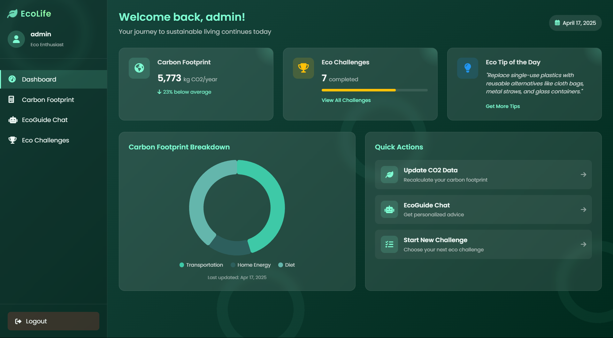
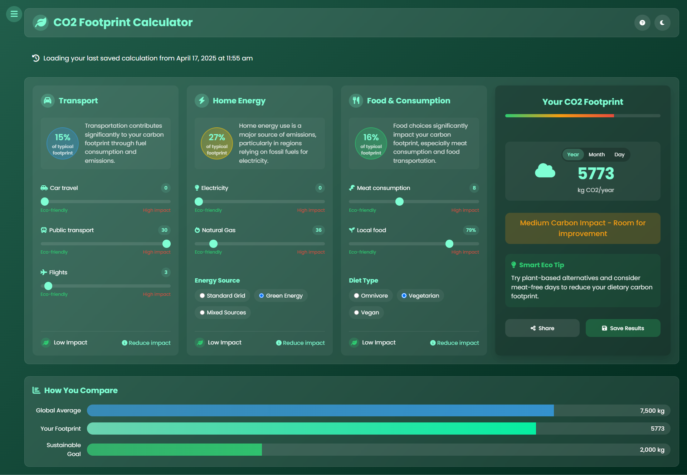
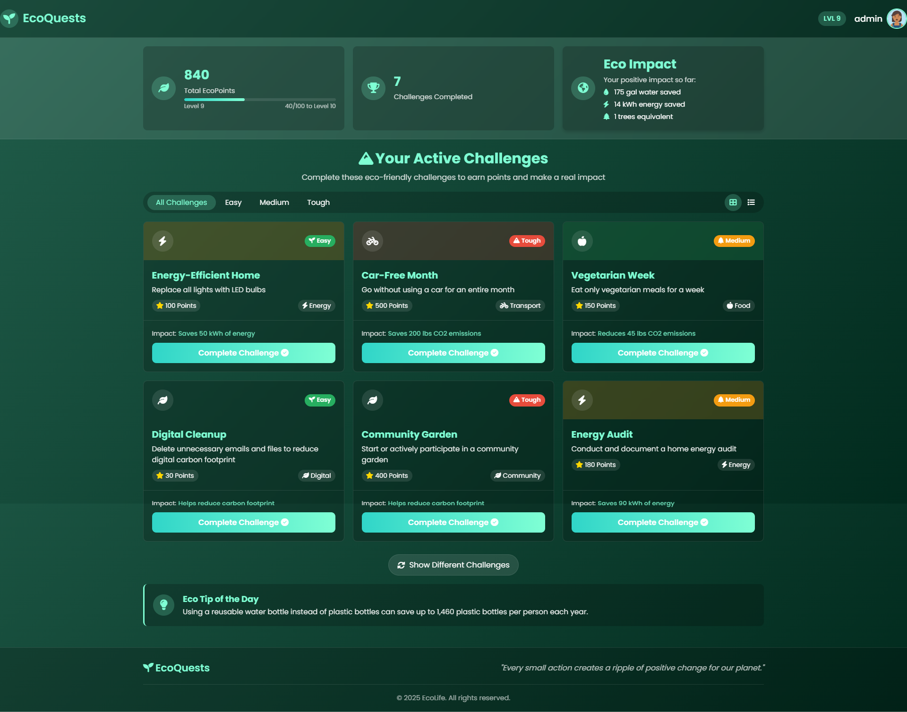
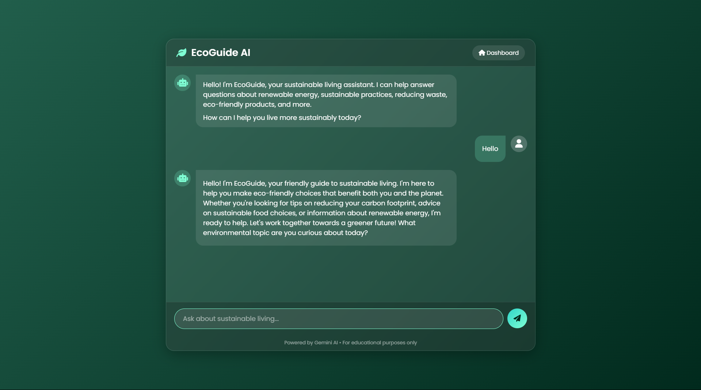

# EcoLife - Personal Carbon Footprint Tracker

EcoLife is a web application designed to help users track, understand, and reduce their carbon footprint through personalized calculations, challenges, and eco-friendly recommendations.

## Screenshots

### Dashboard

*Personal dashboard showing carbon footprint breakdown and progress tracking*

### CO2 Calculator

*Interactive calculator for measuring personal carbon emissions*

### Eco Challenges

*Sustainability challenges to encourage eco-friendly behavior*

### EcoGuide AI Chat

*AI-powered assistant providing personalized sustainability advice*


## 👥 Contributors

- [Shreyans Tatiya](https://github.com/percobain) - 16010123325 - E2 batch
- [Shreya Menon](https://github.com/SM006) - 16010123324 - E2 batch
- [Siddhant Raut](https://github.com/S1MPSID) - 1601012331 - E2 batch


## 🌿 Features

- **Interactive CO2 Calculator**: Calculate your carbon footprint based on lifestyle choices
- **Personalized Dashboard**: View breakdown of emissions by category with visual charts
- **Eco Challenges**: Complete sustainability challenges to earn green points
- **EcoGuide AI Chat**: Get personalized sustainability advice from an AI assistant
- **Progress Tracking**: Monitor your carbon footprint reduction over time

## 🔧 Technology Stack

- PHP 7.4+
- MySQL Database
- JavaScript (Vanilla)
- Chart.js for data visualization
- CSS3 with custom animations
- FontAwesome for icons
- Gemini AI API for the EcoGuide chatbot

## 📂 Project Structure

```
mini-proj/
├── assets/
│   ├── css/
│   │   └── components/
│   │       ├── challenges.css    # Styles for eco challenges
│   │       ├── co2.css           # Styles for CO2 calculator
│   │       ├── dashboard.css     # Styles for user dashboard
│   │       ├── eco-chat.css      # Styles for AI chat interface
│   │       └── lp.css            # Styles for landing page
│   ├── js/
│   │   ├── co2-calculator.js     # Core calculator functionality
│   │   ├── eco-chat.js           # AI chat integration
│   │   └── script.js             # General scripts
│   └── images/                   # Application images
├── includes/
│   ├── config.php                # Database configuration
│   ├── db.php                    # Database connection
│   └── logout.php                # Logout functionality
├── pages/
│   ├── challenges.php            # Eco challenges interface
│   ├── co2.php                   # CO2 calculator main page
│   ├── dashboard.php             # User dashboard
│   ├── eco-chat.html             # AI chat interface
│   ├── landing.html              # Landing page
│   ├── login.php                 # User login
│   ├── save_calculator.php       # Saves CO2 calculation results
│   └── signup.php                # User registration
└── index.php                     # Entry point redirecting to landing/dashboard
```

## 🛠️ Core Components

### CO2 Calculator

The calculator tracks emissions across three main categories:

1. **Transportation**: Car travel, public transport usage, and flights
2. **Home Energy**: Electricity consumption, natural gas usage, and energy sources
3. **Food & Consumption**: Meat consumption, locally sourced food percentage, and diet type

### Dashboard

The dashboard provides visualizations of the user's carbon footprint with:

- Carbon breakdown by category (pie chart)
- Comparison to global averages
- Quick access to tools
- Eco tips based on the user's highest emission areas

### Eco Challenges

Users can participate in sustainability challenges across different categories:
- Energy conservation
- Water usage
- Waste reduction
- Food choices
- Transportation

### EcoGuide AI Chat

An AI-powered assistant that provides:
- Sustainable living advice
- Answers to environmental questions
- Personalized eco-tips based on user habits

## 🚀 Getting Started

### Prerequisites

- PHP 7.4 or higher
- MySQL
- Web server (Apache/Nginx)

### Installation

1. Clone the repository to your web server directory:
    ```
    git clone https://github.com/percobain/wpl.git
    ```

2. Create a MySQL database named `co2calculator`

3. Import the database schema from `database/schema.sql`

4. Configure the database connection in `includes/config.php`:
    ```php
    define('DB_HOST', 'localhost');
    define('DB_USER', 'your_username');
    define('DB_PASS', 'your_password');
    define('DB_NAME', 'co2calculator');
    ```

5. Access the application through your web server

## 📱 Responsive Design

EcoLife is fully responsive and works on:
- Desktop computers
- Tablets
- Mobile phones

The interface adapts to different screen sizes while maintaining functionality and visual appeal.

## 🔐 Authentication

The application includes a secure user authentication system with:
- User registration
- Login/logout functionality
- Session management
- Password hashing

## 📊 Carbon Calculation Methodology

Emissions are calculated using the following factors:
- Car travel: 0.12 kg CO2 per km
- Public transport: 1.5 kg CO2 per trip
- Flights: 90 kg CO2 per hour
- Electricity: 0.5 kg CO2 per kWh
- Natural gas: 2.0 kg CO2 per m³
- Meat consumption: 6.0 kg CO2 per meat meal
- Local food: -0.1 kg CO2 per percentage point of locally sourced food

## 🌟 Future Enhancements

- Social sharing of eco achievements
- Community features and user comparison
- Integration with smart home devices
- Carbon offsetting recommendations
- Expanded challenge categories

